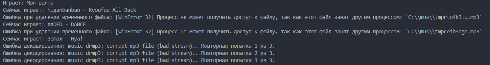

## Yandex Music Tune

> Было реализовано для личных нужд, чисто по приколу.

⚠️ Это неофициальный плеер. Без подписки Яндекс Плюс плеер будет бесполезен.

[](https://pypi.org/project/yandex-music/)
[](https://www.gnu.org/licenses/lgpl-3.0.html)

### Содержание
  - [Введение](#введение)
    1.  [Доступ к вашим данным Яндекс.Музыка](#доступ-к-вашим-данным-яндексмузыка)
  - [Установка](#установка)
  - [Лицензия](#лицензия)

### Введение

Используется стороняя библиотека [Yandex Music API](https://github.com/MarshalX/yandex-music-api)

Так-же там можно более подробно изучить API Яндекс Музыки

Так-же возможны ошибки или пропуск треков (bad stream) не знаю с чем это связано, было лень разбираться но треки подряд идут если вам нужно вы можете исправить это и сделать Pull Request.



Я открыт к любым вопросам и предложениям а так-же вы сами можете сделать pull request и я его приму.

Связаться со мной можно любым удобным для вас способом мои контакты тут [kirillka.ru](https://kirillka.ru)

#### Доступ к вашим данным Яндекс.Музыка

Для получения токена я использовал [эту инструкцию](https://github.com/MarshalX/yandex-music-api/discussions/513#discussioncomment-2729781).

### Установка

Я устанавливал и тестировал на системе Windows 11, но думаю без труда будет работать и на других системах.

python должен быть добавлен в PATH если вы это делаете на Windows, необходимо создать папку mus на диске C:\ для хранения временных файлов. 

Но вы можете выбрать и другой путь просто измените на ваш в коде.

``` shell
python main.py
pip install -r requirements.txt
```

### Лицензия

Вы можете копировать, распространять и модифицировать программное обеспечение при условии, что модификации описаны и лицензированы бесплатно в соответствии с [LGPL-3](https://www.gnu.org/licenses/lgpl-3.0.html). Произведения производных (включая модификации или что-либо статически связанное с библиотекой) могут распространяться только в соответствии с LGPL-3, но приложения, которые используют библиотеку, необязательно.
